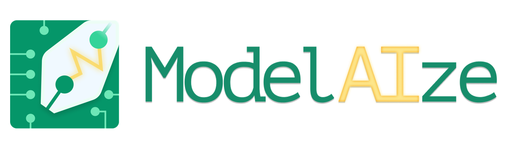

<div align="center"></div>

**ModelAize** is a desktop application that leverages **GEN AI** to generate **data conceptual models** and **web service lists** for your projects. Built using **Electron**, **Vite**, and **React**, it provides an interface to design your web applications.

## Features

- Generation of conceptual data models.
<div align="center"></div>

- Creation of web service lists for web applications.
<div align="center"></div>

- Agent designed to update your model and service list, suggest how to develop new features...
<div align="center"></div>

## Used to run the program

- An **OpenAI API key**.
- A local workspace to store modelisations.

## How the modelization is generated ?

- Step 1 : Describe the application into a prompt
<div align="center"></div>


- Step 2 : Fulfill an application description sheet
<div align="center"></div>


- Step 3 : You can rework the generated models and services with the chatbot to adapt to your need.

## Installation

1. Clone this repository:

    ```bash
    git clone https://github.com/cDelage/modelaize.git
    cd modelaize
    ```

2. Install dependencies:

    ```bash
    npm install
    ```

3. Start the application:

    ```bash
    npm run dev
    ```

## Configuration

1. Add your **OpenAI API key** in the application’s configuration interface.
2. Select a local **workspace** for your files.

## Technologies Used

- **Electron**: For building the desktop application.
- **Vite**: For fast development and efficient bundling.
- **React**: For creating a dynamic and interactive user interface.

## Contributing

Contributions are welcome! Feel free to open an **issue** or submit a **pull request**.
